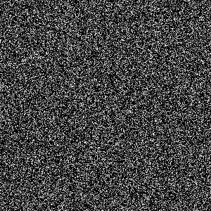
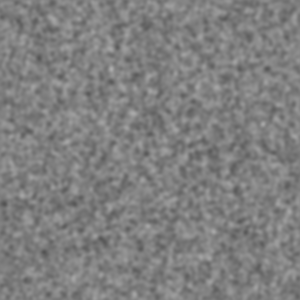
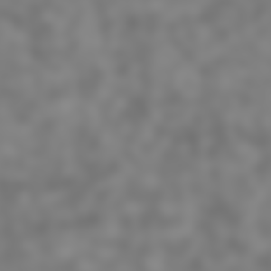
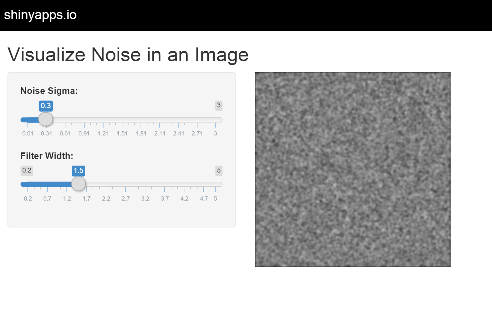

Visualizing Noise and Filtering in Image Data
========================================================
author: Dr. Zed ("Almost Dead?! I can fix that.")
date: July 26, 2015

Submitted for Coursera Data Science 9 - Developing Data Products

Noise, Image Data and Filtering
========================================================

- Famous Quote: "Measure the noise and the signal is free"
- Noise processes in image data often come from distributons we've studied in the Data Science Track: Gaussian, Poisson, etc.
- The same tools, test and statistical metrics can be applied
 - Typical data sets are 2D numerical arrays of  Intensity(x,y)
- Spatial Filter (formally 2D convolution) replaces an image filter with the weighted average of nearby pixels
 - Weighting function is called the kernel (a 2D Gaussian is used for this project with a single parameter: radial st. dev)
- The filtered image is smoother, but the noise becomes correlated between pixels and care must be taken in interpreting results

server.R Key Features
========================================================
- Create a 300 x 300 array of normally distributed pixel values, mean=0, with st. dev set by slider in UI
- Filter with "blur" function in spatstat package
 - uses a radial gaussian kernal with st. dev set by second slider
- Save as temporary PNG image for display
- Examples (noise stdev=0.3, Filter width: 0.1, 2 & 6, left to right)

ui.R Key Features
========================================================

- This simple demo has two input values, with a slider control for each:
 - Pixel noise standard deviation
 - Filter width standard deviation
- And one output:
 - the resulting image in PNG format
- The image is updated every time either slider is adjusted
 - Image size chosen so that results are big enough to be easy to see but small enough to update quickly
- App could be modified to allow selection of noise distribution, different kernels (box car, motion blur, edge detect, etc.) 

The Shiny App
========================================================

https://controlz.shinyapps.io/project11
